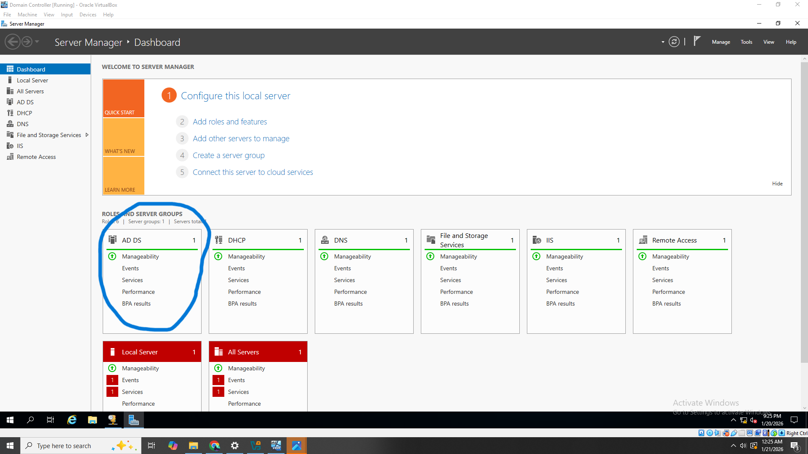
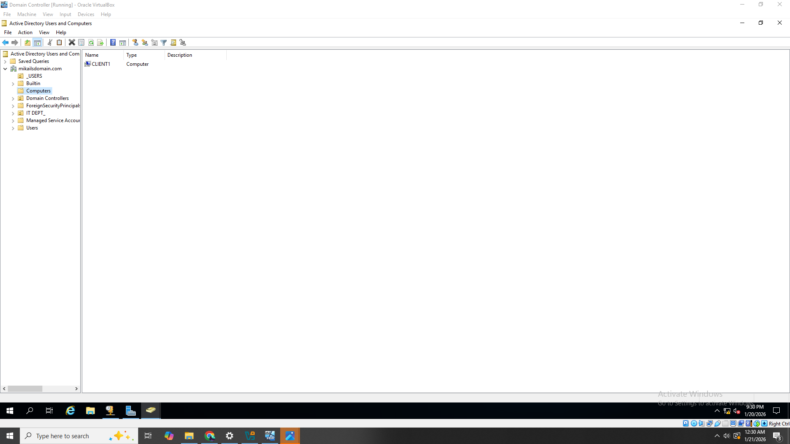

# Active-Directory-VM-Project

This homelab documents my **Active Directory Domain Services (AD DS) lab** built using **VirtualBox**.  
The lab simulates a small enterprise environment with a **Windows Server 2019 Domain Controller** and a **Windows 10 Client** joined to the domain.

---

## 📖 Lab Overview
- **Domain Name**: mikailsdomain.com (previously was mhayescs.com and I changed it just because)
- **Domain Controller**: Windows Server 2019 (DC)  
- **Client**: Windows 10 (CLIENT1)  
- **Roles Installed**: Active Directory, DNS, DHCP, Remote Access  

---

## 🗂️ Lab Design

**Network Setup**:
- Domain Controller (Internal NIC) → `172.16.0.1`
- DHCP Range → `172.16.0.100 - 200`
- DNS → `172.16.0.1`
- Client receives IP and joins domain

---

## ⚙️ Setup Steps

### 1. Configure Server 2019
- Installed Windows Server 2019 in VirtualBox
- Added **2 NICs**: External (home router) + Internal (static IP: `172.16.0.1`)
- Renamed server to `DC`

### 2. Install Active Directory & DNS
- Installed **AD DS** role
- Promoted to Domain Controller
- Created forest/domain: **mikailsdomain.com**
 

### 3. Configure DHCP
- Installed DHCP role
- Created IPv4 scope `172.16.0.100 - 200`
- Set default gateway: `172.16.0.1`
- Authorized DHCP in AD

### 4. Join Windows 10 Client
- Installed Windows 10 in VirtualBox
- Connected client NIC to **Internal Network**
- Client pulled IP from DC DHCP
- Joined domain: **mikailsdomain.com**

### 🌐 RAS/NAT Configuration
To allow internal domain clients to access the internet, RRAS was configured on the Domain Controller using NAT.  
The server has two network interfaces: one external (home LAN) and one internal (lab network).  
RRAS translates traffic from the internal network to the external network, allowing clients to browse the web securely.

## 👥 PowerShell Script – Bulk AD User Generator

This PowerShell script automates the creation of user accounts in an **Active Directory homelab** environment. It generates realistic test users and places them into a specified Organizational Unit (OU), making it easy to simulate a real enterprise domain.

### 🔧 Features
- Automatically creates multiple domain users  
- Randomizes first and last names  
- Generates unique usernames  
- Sets a default password  
- Forces users to change password at first login  
- Places users into a chosen OU  

---

## ✅ Verification
- Client successfully joined domain
- DNS & DHCP functioning
- Group Policies applied correctly

---

## 🔮 Future Improvements
- Add Group Policies for security baselines
- Create multiple OUs & user groups
- Add second Domain Controller for redundancy
- Test cross-platform (Linux/Mac) domain joins

---

## 📌 Author
**Mikail Hayes**
2025 CS Graduate | Cybersecurity Professional | Homelab Builder
